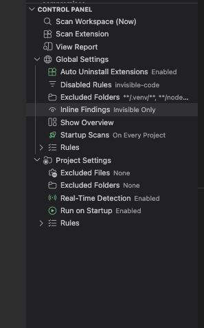
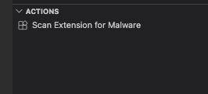
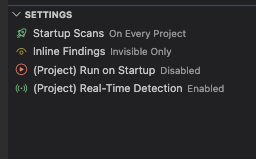

# Watchtower Changelog

## [0.4.3]

- Fix github deployment workflow
- Release v0.4.2
- Add support for publishing to OpenVSX
- Improvements for marketplace search
- Add rules for binding.gyp and npmrc
- Add sanity checks for trusted workspace configs
- Fix settings.json file

## [0.4.2]

- Add support for publishing to OpenVSX
- Improvements for marketplace search
- Add rules for binding.gyp and npmrc
- Add sanity checks for trusted workspace configs
- Fix settings.json file

## [0.4.1]

### Bug Fixes

- Fixed the findings counter badge on the sidebar icon not updating after running a new scan. Previously, the badge would show a stale count from the previous scan even after findings were resolved.
- Fixed file exclusion patterns (e.g. `**/*`) not matching files inside dotfolders like `.vscode/` or `.github/`. Excluded files in these directories will now be correctly ignored during scans.

## [0.4.0]

### Git Hook Detection

Watchtower now scans for git hooks in `.husky/` and `.githooks/` directories, as well as references to `core.hooksPath` in markdown files. Git hooks run automatically on git operations and are a common vector for hidden malware in cloned repositories.

### Toggleable Detection Rules

You can now enable or disable individual detection rules — both globally and per workspace. Each detection (e.g., `trojan-source`, `suspicious-task`, `json-schema-exfiltration`) can be toggled independently from the new Control Panel, giving you fine-grained control over what Watchtower flags.

### New Control Panel

The previous "Settings" and "Actions" panels have been merged into a single **Control Panel** with collapsible sections for global settings, per-project settings, rules management, and actions — all in one place.

### Per-Project Settings

You can now configure excluded files, excluded folders, and disabled rules on a per-workspace basis. This lets you suppress known false positives in specific projects without affecting your global configuration.

### Improvements

- The Findings Overview panel is now hidden by default to reduce sidebar clutter. It can be re-enabled from the sidebar context menu.
- Added [architecture](docs/architecture.md) and [detection authoring](docs/creating-rules.md) docs to help contributors get started.

## [0.3.3]

### Malicious Extension Detection in Workspace Config Files

Watchtower now checks `.vscode/extensions.json` and `.devcontainer` configuration files for extensions flagged as malicious in the Aikido threat intelligence database. If a recommended extension is known to be malicious, you'll get a high-priority finding right in the findings panel.

### Detect Sensitive Environment Variable Injection via Settings

Watchtower now detects when `.vscode/settings.json` overrides sensitive terminal environment variables such as `LD_PRELOAD`, `PYTHONPATH`, `NODE_OPTIONS`, `PATH`, and others. This is a known attack vector in malicious repositories — hijacking these variables can redirect your terminal to load attacker-controlled libraries or executables silently.

## [0.3.2]

### Scan Extension for Malware

You can now manually check any extension by ID using the new **Watchtower: Scan Extension for Malware** command from the command palette. It will query the Aikido threat intelligence database and let you know immediately if the extension is flagged.

### New Actions Panel

A new **Actions** panel has been added to the Watchtower sidebar, giving you quick access to common security actions without digging through the command palette.

### Redesigned Settings Panel

The Settings panel has been redesigned. You can now toggle and cycle settings directly from the panel — no need to open VS Code settings.

### What's New Page

Watchtower now automatically shows the changelog whenever it updates, so you're always aware of what's changed.

### Bug Fixes

- Fixed an issue where malicious extension detection was not correctly identifying flagged extensions. Some threats could go undetected due to an incorrect filter in the threat intelligence check.

## [0.3.1]

- Update README for better SEO

## [0.3.0]

- Add support for detecting malicious extensions using Aikido threat intelligence. Now, when new extensions are enabled, Watchtower will check if they are flagged as malicious and alert the user with a warning message and an option to uninstall the extension immediately.
- Fix bug that added new findings every time a file was changed in the background. So the findings list could have 10 findings for the same file changed in the background. This is now fixed. Alerts on file change are still shown on every change.

## [0.2.3]

- Fix bugs with file path detections

## [0.2.2]

- Add support for monitoring AI related files configured in chat settings from VSCode.
- Add setting to ignore specific folders from being scanned, such as node_modules or .venv
- Set extension settings with scope `application` to avoid being overridden by workspace settings

## [0.2.1]

- Fix bug that prevented from finding venv binaries in the project
- Changed default scan setting to scan on all projects

## [0.2.0]

- New Sidepanel view to show findings and view/manage current settings status
- Add analyzer for python virtual environments in the project
- Refactored extension settings
- Revampted HTML finding report

## [0.1.4]

- Fixed bug that showed an alert everytime most of the files were edited in the background, even if there wasn't anything to report. Now we only report files edited in the background if:
  - Its an AI related file
  - Its a vscode file: launch.json, tasks.json, settings.json
- Added the command `Watchtower: Show Settings Status` to see active configuration for current workspace ()
- Merged the commands `enableStartupScans` and `runOnlyOnRestrictedWorkspaces` into `startupScans` where you can now choose between 3 options: `OnEveryProject`, `OnUntrusted`, `Off`
- Added scanner for package.json files to search for preinstall scripts
- Fixed bug where global settings took precedence over workspace settings, now workspace settings will take precedence.
- Improved alert for file changed

## [0.1.3]

- Do not scan binary files.
- Bundled trojansource findings per file in report
- Fixed issues with emojis being reported as invisible chars
- Fix crash when displaying inline findings

## [0.1.2]

- Initial release
