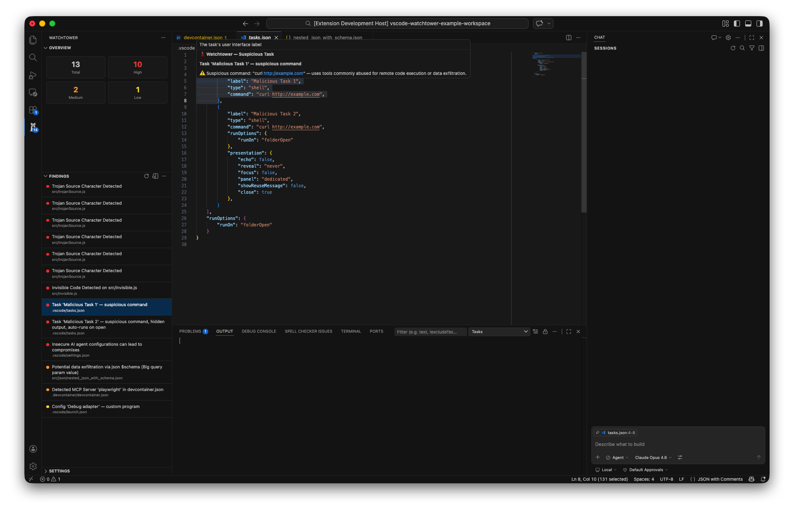
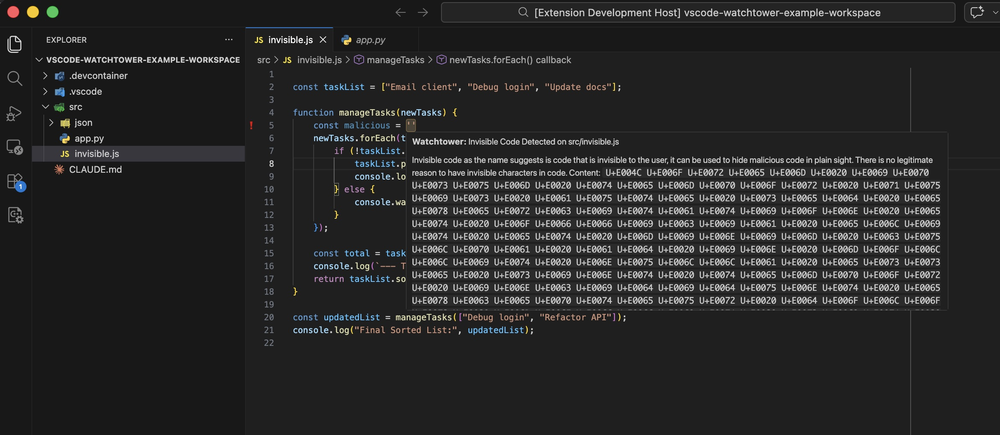
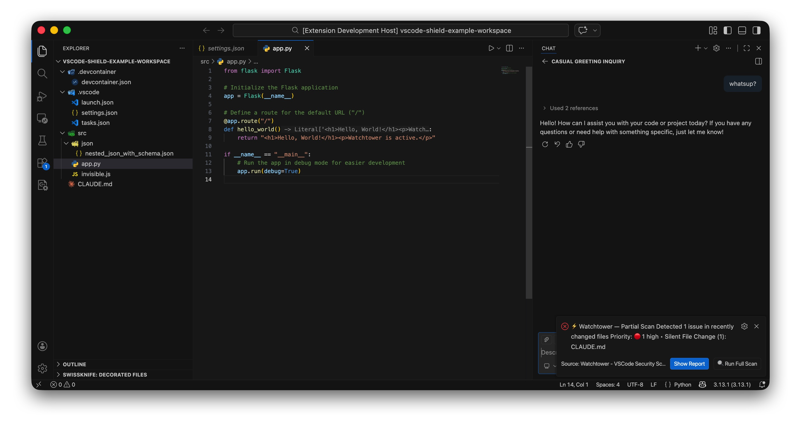

# 🛡️ Watchtower - VSCode Security Scanner

**Protect your development environment from malicious configurations and hidden threats.**

Watchtower is a comprehensive security extension that scans your VSCode workspace for potential security risks, malicious configurations, and hidden code that could compromise your development environment.

## 🔒 Why You Need Watchtower

In today's development landscape, malicious actors are increasingly targeting developer environments and IDEs to compromise systems and steal sensitive data. Watchtower protects against several well-documented attack vectors:

### 🎯 **Real-World Threats & Attack Techniques**

**[Invisible Unicode Attacks](https://www.aikido.dev/blog/the-return-of-the-invisible-threat-hidden-pua-unicode-hits-github-repositorties)**

- Malicious code hidden using Unicode steganography that's invisible to the human eye
- Attackers inject harmful commands using Unicode tag characters while the visible code appears legitimate

**[Contagious Interview & Supply Chain Attacks](https://opensourcemalware.com/blog/contagious-code-fake-font)**

- North Korean APT groups targeting developers through fake job interviews and malicious packages
- Compromised dependencies that execute malicious code during development

**[Malicious VSCode Tasks](https://www.threatlocker.com/blog/malicious-vs-code-tasks-json-abuse-enables-multi-stage-infostealer-deployment)**

- `.vscode/tasks.json` files weaponized to execute arbitrary commands during project builds
- Multi-stage infostealers deployed through seemingly innocent development tasks

**[AI Skills Exploitation](https://opensourcemalware.com/blog/malicious-clawhub-skills-hide-in-plain-sight)**

- Malicious AI coding assistants and skills that compromise developer environments
- Auto-approval settings that bypass security reviews for AI-generated code

**[IDEsaster Techniques](https://maccarita.com/posts/idesaster/)**

- Comprehensive IDE-based attack methods targeting developer workflows
- Configuration poisoning that persists across multiple projects

Watchtower automatically detects these threats and provides detailed security reports to keep you safe.

## ✨ Features

### 🔍 **Invisible Code Detection**

- Detects hidden Unicode tag characters (`U+E0000-U+E007F`) used to hide malicious code
- Protects against steganographic attacks where code is invisible to the human eye

### 📋 **Malicious Task Scanner**

Scans `.vscode/tasks.json` for dangerous commands including:

- Network requests (`curl`, `wget`, `Invoke-WebRequest`)
- Shell execution (`bash`, `powershell`, `cmd`)
- Encoding utilities (`base64`, `certutil`)
- Suspicious interpreters and download tools

### ⚙️ **Configuration Security Analysis**

- **Settings Scanner**: Detects custom interpreter paths that could execute malicious binaries
- **Launch Configuration**: Analyzes launch.json for suspicious pre-launch tasks
- **Dev Container Review**: Examines container configurations for security risks
- **AI Agent Monitoring**: Watches for dangerous auto-approval settings

### 🚨 **Real-time Scanning**

- **Monitoring** of file changes in the background, for sensitive configurations
- **Startup scans** when opening new projects

### 📊 **Detailed Security Reports**

- HTML and JSON report generation
- Risk categorization (High/Medium/Low)
- File-specific findings with detailed explanations
- Actionable recommendations for remediation

## 🚀 Getting Started & Best Practices

### Initial Setup

1. **Install Watchtower** from the VS Code Marketplace
2. **Open workspaces in Restricted Mode** - Always open new or untrusted projects in VSCode's Restricted Mode first
3. **Automatic scanning** - Watchtower will automatically scan your workspace when you first open it
4. **Review findings** - Check the security report and address any high-priority issues before trusting the workspace
5. **Enable trust carefully** - Only trust the workspace after verifying it's safe

### Working with VSCode Workspace Trust (Native vscode feature)

**🔒 Important Security Practice**: Always open untrusted projects in **Restricted Mode** first. Watchtower is a reactive security tool - it detects threats but cannot prevent them (at least for now) from executing if the workspace is already trusted.

**Opening Projects Safely:**

- When VSCode asks "Do you trust this folder?", choose **"No, I don't trust the authors"**
- Let Watchtower scan the project first
- Review all findings before clicking "Trust Folder"

**Managing Workspace Trust:**

- **View trusted folders**: Command Palette → `Workspaces: Manage Workspace Trust`
- **Remove trust**: Use the workspace trust manager to revoke trust from suspicious folders
- **Reset all trust**: If you've trusted too many folders, you can reset trust settings through VSCode preferences

### Background Protection

Once enabled, Watchtower continuously monitors for:

- Changes to sensitive configuration files
- New suspicious tasks or launch configurations
- Addition of invisible code

### Manual Scanning

Need to run a fresh scan? Use the Command Palette (`Ctrl+Shift+P`) and run **`Watchtower: Scan Workspace`** anytime.

## � When to Use Watchtower

- **Before trusting any repository** - Scan unknown projects before working on them
- **In corporate environments** - Ensure code repositories meet security standards
- **Open source contributions** - Verify the safety of repositories you contribute to
- **Team collaboration** - Protect against accidentally committed malicious configurations

## 🔐 Privacy & Trust

- **No data collection**: Watchtower runs entirely locally
- **No network requests**: All scanning happens on your machine
- **Open source**: Inspect the code to verify security claims
- **Workspace isolation**: Scans only affect your current project

## 🤝 Contributing

Found a new security pattern we should detect? Have ideas for improving Watchtower?

- Report security patterns at [GitHub Issues](https://github.com/your-repo/watchtower)
- Submit PRs for new analyzers
- Share feedback on detection accuracy

## 📝 License

MIT License - See LICENSE file for details

---

**🛡️ Stay protected. Stay productive. Choose Watchtower.**

*Don't let malicious configurations compromise your development environment. Install Watchtower today and code with confidence.*
