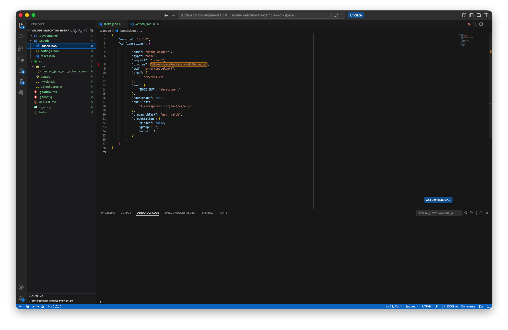

# 🛡️ Watchtower - VS Code Security Scanner

> **Scan untrusted workspaces for malicious code, hidden threats, and supply chain attacks — before you run anything.**

Watchtower automatically scans your VS Code workspace for **invisible Unicode attacks**, **malicious tasks**, **compromised extensions**, and **dangerous AI agent configurations**. Open that sketchy GitHub repo. Clone that interview take-home. Contribute to that open source project. Watchtower checks it first.

---

## 🔍 What Gets Scanned

| Category | What Watchtower Checks |
|---|---|
| 👁️ **Invisible Unicode** | Hidden code using Unicode tag steganography (`U+E0000–U+E007F`) — invisible to the human eye |
| 📋 **Malicious Tasks** | `tasks.json` commands that run shells, download payloads, or use encoding tricks (`curl`, `base64`, `certutil`) |
| ⚙️ **Settings Hijacking** | Custom interpreter paths pointing to custom binaries |
| 🧩 **Compromised Extensions** | Extensions cross-referenced against live threat intelligence, with **auto-uninstall** |
| 🤖 **AI Agent Exploits** | Dangerous auto-approval settings in Copilot, Claude, Cursor, and other AI coding assistants |
| 🚀 **Launch Configurations** | Suspicious pre-launch tasks hidden in `.vscode/launch.json` |
| 🐳 **Dev Container Risks** | Security misconfigurations in `.devcontainer` files |

And more...

## 🚀 Getting Started

**Recommended workflow for untrusted projects:**

1. **Open the project** — VS Code will ask "Do you trust this folder?"
2. **Choose "No, I don't trust the authors"** to stay in Restricted Mode
3. **Watchtower auto-scans on open** — review findings in the sidebar
4. **Only click "Trust Folder"** after verifying the results are clean

> **Why Restricted Mode?** Watchtower detects threats — but if you trust a workspace first, VS Code may already execute malicious tasks and scripts before the scan completes. Open untrusted, scan first, trust after.

**Manual scan:** `Ctrl+Shift+P` → `Watchtower: Scan Workspace`

## ⚙️ Configuration

Access settings via **Settings → Extensions → Watchtower** for global settings or the sidebar settings panel for Workspace specific settings.

### Global Settings

| Setting | Default | Description |
|---|---|---|
| `watchtower.startupScans` | `OnEveryProject` | `OnEveryProject` · `OnUntrusted` · `Off` |
| `watchtower.inlineFindings` | `invisible` | Inline highlights: `all` · `invisible` · `none` |
| `watchtower.autoUninstallMalicious` | `true` | Auto-remove extensions flagged by threat intel |
| `watchtower.excludedFolders` | `node_modules`, `.git`, `.venv`… | Glob patterns to skip during scanning |

### Workspace Settings

## 🎯 Real-World Attack Context

Watchtower was built in response to documented, active attack campaigns targeting developers:

- **[Invisible Unicode / Trojan Source](https://www.aikido.dev/blog/the-return-of-the-invisible-threat-hidden-pua-unicode-hits-github-repositorties)** — hidden code in open source repositories
- **[Contagious Interview (DPRK)](https://opensourcemalware.com/blog/contagious-code-fake-font)** — North Korean APT groups targeting developers via fake job interviews
- **[tasks.json infostealers](https://www.threatlocker.com/blog/malicious-vs-code-tasks-json-abuse-enables-multi-stage-infostealer-deployment)** — multi-stage malware via `.vscode` configuration files
- **[Malicious AI skills](https://opensourcemalware.com/blog/malicious-clawhub-skills-hide-in-plain-sight)** — compromised coding assistant plugins
- **[IDEsaster](https://maccarita.com/posts/idesaster/)** — IDE-specific attack vectors targeting developer workflows

---

## 🔐 Privacy

- **Runs locally** — no telemetry, no code is sent anywhere
- **Anonymous threat intel** — extension checks use an external API with no identifying data
- **Open source** — [audit the code yourself](https://github.com/luisfontes19/watchtower)

---

## 🤝 Contributing

Found a threat pattern Watchtower should detect? Open an issue or PR on [GitHub](https://github.com/luisfontes19/watchtower/issues).

To get started with the codebase:

- **[Architecture overview](docs/architecture.md)** — how the extension is organized and where to look
- **[Creating detections](docs/detections.md)** — how to add new analyzers and rules

## 📝 License

MIT — see [LICENSE.md](LICENSE.md)
