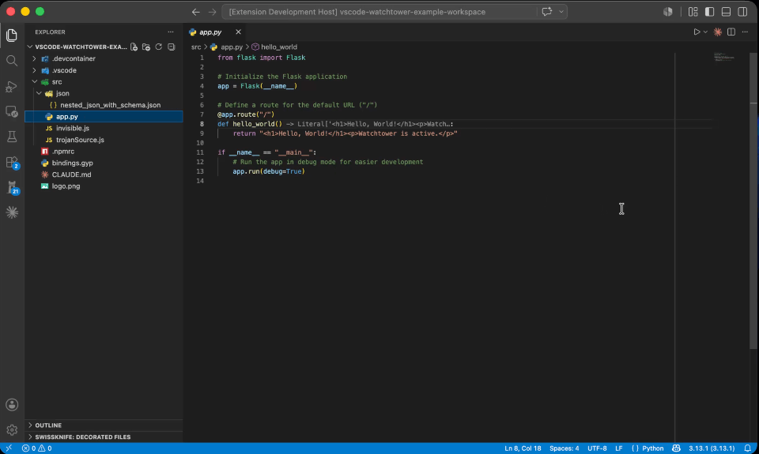
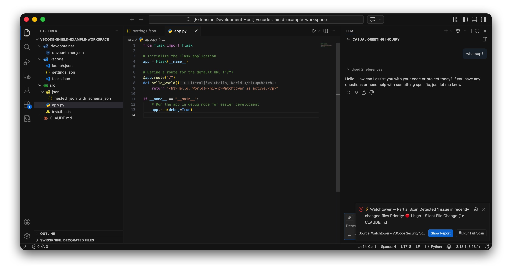

# 🛡️ Watchtower - Security Scanner for VS Code

> **Opening a repo can compromise your machine before you run a single line of code.** Watchtower scans untrusted workspaces for malicious code, hidden Unicode threats, and supply chain attacks - automatically, locally, in seconds.

That sketchy GitHub repo. That interview take-home. That open source project you're about to contribute to. A malicious `tasks.json`, a hijacked `settings.json`, or invisible Unicode characters can execute code or poison your AI assistant the moment VS Code opens the folder. **Watchtower checks it first.**

---

## 🔍 What Gets Scanned

| Category | What Watchtower Checks |
|---|---|
| 👁️ **Invisible Unicode** | Hidden code using Unicode tag steganography (`U+E0000–U+E007F`) - invisible to the human eye, readable by compilers and AI agents |
| 📋 **Malicious Tasks** | `tasks.json` commands that run shells, download payloads, or use encoding tricks (`curl`, `base64`, `certutil`) |
| ⚙️ **Settings Hijacking** | Custom interpreter paths in `settings.json` pointing to attacker-controlled binaries |
| 🧩 **Compromised Extensions** | Installed extensions cross-referenced against live threat intelligence, with **auto-uninstall** |
| 🤖 **AI Agent Exploits** | Dangerous auto-approval settings and prompt injection vectors in Copilot, Claude Code, Cursor, and other AI coding assistants |
| 🚀 **Launch Configurations** | Suspicious pre-launch tasks hidden in `.vscode/launch.json` |
| 🐳 **Dev Container Risks** | Security misconfigurations in `.devcontainer` files |
| 📦 **Build Hooks** | Malicious `binding.gyp` and `.npmrc` configurations |

…and more. Detections run **automatically on workspace open** and in **real time** as files change.

## 🚀 Getting Started

Install Watchtower, then follow this workflow for untrusted projects:

1. **Open the project** - VS Code asks *"Do you trust this folder?"*
2. **Choose "No, I don't trust the authors"** to stay in Restricted Mode
3. **Watchtower auto-scans on open** - review findings in the sidebar
4. **Only click "Trust Folder"** after verifying the results are clean

> **Why Restricted Mode first?** If you trust a workspace before scanning, VS Code may already execute malicious tasks and scripts before the scan completes. Open untrusted, scan first, trust after.

**Manual scan:** `Ctrl+Shift+P` → `Watchtower: Scan Workspace`

## ✨ Features

### Real-time threat notifications

Watchtower watches sensitive files (AI agent instructions, VS Code configs) and alerts you the moment something changes behind your back.

### Inline findings, right in your editor

Threats are flagged where they live - including hidden Unicode payloads decoded so you can see exactly what an attacker tried to smuggle in.

### Full control panel

Enable or disable individual rules, tune per-project behavior, exclude folders, and export findings to JSON for CI or team review.

## 🎯 Real-World Attack Context

Watchtower was built in response to documented, active attack campaigns targeting developers:

- **[Invisible Unicode / Trojan Source](https://www.aikido.dev/blog/the-return-of-the-invisible-threat-hidden-pua-unicode-hits-github-repositorties)** - hidden code in open source repositories
- **[Contagious Interview (DPRK)](https://opensourcemalware.com/blog/contagious-code-fake-font)** - North Korean APT groups targeting developers via fake job interviews
- **[tasks.json infostealers](https://www.threatlocker.com/blog/malicious-vs-code-tasks-json-abuse-enables-multi-stage-infostealer-deployment)** - multi-stage malware via `.vscode` configuration files
- **[Malicious AI skills](https://opensourcemalware.com/blog/malicious-clawhub-skills-hide-in-plain-sight)** - compromised coding assistant plugins
- **[IDEsaster](https://maccarita.com/posts/idesaster/)** - IDE-specific attack vectors targeting developer workflows

## ❓ FAQ

**Is Watchtower an antivirus for VS Code?**
Not exactly - it's a workspace security scanner. It focuses on threats specific to developer environments: malicious repo configurations, invisible Unicode attacks, compromised extensions, and AI agent exploits that traditional antivirus tools don't understand.

**Does Watchtower send my code anywhere?**
No. All scanning runs locally. The only network call is an anonymous extension-reputation check against threat intelligence, with no identifying data and no source code transmitted.

**Will it slow down VS Code?**
No. Scans run asynchronously, skip binary files and common dependency folders (`node_modules`, `.venv`, …), and finish in seconds on typical projects.

**Can I use it on every project, not just untrusted ones?**
Yes. By default Watchtower scans every project on startup and in real time. You can restrict it to untrusted workspaces only, or disable automatic scans, via `watchtower.startupScans`.

**I found a false positive / a threat it missed. What do I do?**
Open an issue on [GitHub](https://github.com/luisfontes19/watchtower/issues) - detection rules are actively maintained and community reports drive new rules.

## 🔐 Privacy

- **Runs locally** - no telemetry, no code is sent anywhere
- **Anonymous threat intel** - extension checks use an external API with no identifying data
- **Open source** - [audit the code yourself](https://github.com/luisfontes19/watchtower)

## ⭐ Support the Project

If Watchtower caught something - or just gave you peace of mind - it helps a lot if you:

- **[Leave a review on the Marketplace](https://marketplace.visualstudio.com/items?itemName=luisfontes19.watchtower&ssr=false#review-details)** - ratings directly improve discoverability so more developers stay safe
- **[Star the repo on GitHub](https://github.com/luisfontes19/watchtower)**
- **Share it** with your team - security is a group effort

## 🤝 Contributing

Found a threat pattern Watchtower should detect? Open an issue or PR on [GitHub](https://github.com/luisfontes19/watchtower/issues).

To get started with the codebase:

- **[Architecture overview](docs/architecture.md)** - how the extension is organized and where to look
- **[Creating detections](docs/creating-rules.md)** - how to add new analyzers and rules

## 📝 License

MIT - see [LICENSE.md](LICENSE.md)
